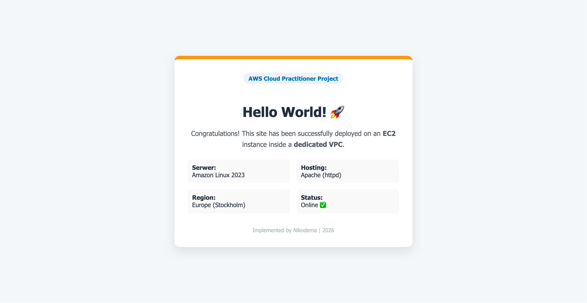

# AWS_EC2Instant
A professional demonstration of provisioning a secure, public-facing web server on Amazon Web Services (AWS) using EC2 and custom VPC networking.
# 🌐 AWS Cloud Infrastructure: Web Server Deployment

[](https://aws.amazon.com/ec2/)
[](https://www.linux.org/)

# AWS Cloud Infrastructure: Secure Web Server Deployment

A professional demonstration of provisioning a secure, public-facing web server on Amazon Web Services (AWS) using EC2 and custom VPC networking.

## 📌 Project Overview
This project focuses on the manual orchestration of AWS resources to host a live web application. The primary goal was to move beyond default settings and build a custom, secure network environment from scratch, adhering to cloud security best practices.

## 🏗 Architecture
The deployment follows a standard cloud-tier architecture:
* **VPC:** Custom Virtual Private Cloud with a `10.10.0.0/16` CIDR block.
* **Public Subnet:** Dedicated subnet (`10.10.0.0/24`) configured for public traffic.
* **Connectivity:** Internet Gateway (IGW) attached to the VPC with a configured Route Table for external access.
* **Compute:** EC2 Instance (t3.micro) running Amazon Linux 2023.


## 🛠 Tech Stack & Services
* **Cloud Provider:** AWS (Amazon Web Services)
* **Compute:** EC2 (Elastic Compute Cloud)
* **Networking:** VPC, Subnets, Internet Gateway, Route Tables
* **Security:** Security Groups (Stateful Firewall)
* **Web Server:** Apache (httpd)
* **OS:** Amazon Linux 2023

## 🔒 Security Implementation
A key focus of this project was the **Principle of Least Privilege (PoLP)**:
* **Inbound SSH (Port 22):** Restricted strictly to my specific local IP address to prevent unauthorized terminal access.
* **Inbound HTTP (Port 80):** Opened to the public (`0.0.0.0/0`) to allow web traffic.
* **Outbound Traffic:** Fully restricted to necessary updates and patches.

## 🚀 Implementation Steps

### 1. Networking Setup
* Provisioned a custom VPC and Subnet.
* Created and attached an Internet Gateway.
* Configured Route Tables to associate the public subnet with the IGW.

### 2. Instance Launch & Configuration
* Launched an EC2 instance using a generated SSH Key Pair.
* Assigned a custom Security Group to handle traffic filtering.
* Connected via SSH to perform system administration.

### 3. Server Provisioning
The following shell commands were used to bootstrap the environment:

```bash
# Update system packages
sudo yum update -y

# Install and enable Apache Web Server
sudo yum install -y httpd
sudo systemctl start httpd
sudo systemctl enable httpd

# Deploy the "Hello World" landing page
echo "<h1>Hello World from AWS EC2</h1>" | sudo tee /var/www/html/index.html
```
### 4. ## 📈 Key Results
Successfully validated the deployment via the public IPv4 address. Below is the final dashboard serving live content from the EC2 instance.


